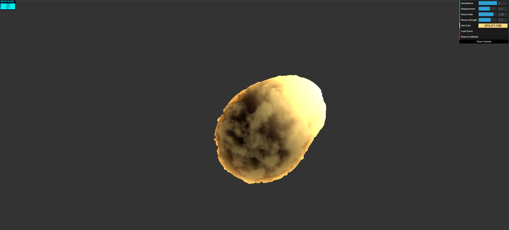

# HW 1: WebGL Fireball

## My Submission

**Live Demo：** https://sqqqqqqs.github.io/hw01-fireball/

  

A noise-driven fireball, rendered entirely in the vertex/fragment shaders.

### What it does

The base icosphere is displaced in the vertex shader with two layers of noise, then colored in the fragment shader based on how much each point was displaced:

- **Low-frequency, high-amplitude shape** — a sum of sine waves along each axis (plus a triangle-wave wobble) gives the fireball its big, uneven lumps instead of a perfect sphere.
- **Domain warp** — before either noise layer is sampled, the input position is perturbed by a coarser noise field. Without this the low-frequency waves shift in sync everywhere at once and the whole sphere looks like it's "breathing"; warping the input first makes it roil unevenly instead.
- **Higher-frequency, lower-amplitude fBm** — 4 octaves of value noise add fine surface detail on top of the big shape, plus a thin "vein" ridge picked out wherever the detail noise sits near its midpoint.
- **Fire palette** — the fragment shader eases between a dark ember color and a bright "hot" color based on the local noise detail and how far a vertex is displaced, so raised/noisy areas read as hotter. A fresnel-style rim term adds a warm glow around the silhouette, and the whole thing self-illuminates (it never goes fully black on the side facing away from the light, since fire doesn't need external lighting to be visible).
- Both shaders animate off a `u_Time` uniform — the surface continuously roils, and the color gets a very subtle flicker over time.

**Toolbox functions used** : `bias`, `gain`, `triangleWave`, and `pulse` (implemented as the smooth Gaussian-like `cubicPulse`, not a hard step).

### Interactivity

dat.GUI exposes five live controls: `tesselations` (mesh density), `Displacement` (overall bump strength), `Noise Scale` (fine detail frequency), `Mouse Strength` (how hard the cursor pushes), and `Hot Color` (the palette's hottest color) — plus a **Reset to Defaults** button that snaps everything back to a clean baseline look.

### Extra Spice: Mouse Interactivity

Clicking and holding on the fireball casts a ray from the camera through the cursor, intersects it with the fireball's approximate bounding sphere, and uses that hit point to bulge the surface outward and brighten it — so the fireball can be pushed and prodded with the cursor in real time.

## Objective
Get comfortable with using WebGL and its shaders to generate an interesting 3D, continuous surface using a multi-octave noise algorithm.

## Getting Started
- __Fork__ this repository
- Run `npm install` and `npm run dev` to set up the dependencies for this project
- Under the Github repo settings, navigate to "Build and deployment" -> "Source", and select **GitHub Actions**
- Push (or re-push) to `master`. The workflow will build your project and deploy it automatically. The project should be visible at http://username.github.io/repo-name.

## Assignment Details
- You will alter the vertex and fragment shaders used to render the Icosphere so that it looks like a fireball.
- Your vertex shader should apply a low-frequency, high-amplitude displacement of your sphere so as to make it less uniformly sphere-like. You might consider using a combination of sinusoidal functions for this purpose. We recommend a function of the form `f(x, y, z) = h` to displace your vertices along a vector, such as their surface normals.
- Your vertex shader should also apply a higher-frequency, lower-amplitude layer of fractal Brownian motion to apply a finer level of distortion on top of the high-amplitude displacement.
- Your fragment shader should apply a gradient of colors to your fireball's surface, where the fragment color is correlated in some way to the vertex shader's displacement.
- Both the vertex and fragment shaders should alter their output based on a uniform time variable (i.e. they should be animated). You might consider making a constant animation that causes the fireball's surface to roil, or you could make an animation loop in which the fireball repeatedly explodes.
- Across both shaders, you should make use of at least four of the functions discussed in the Toolbox Functions slides.

## Noise Application
View your noise in action by applying it as a displacement on the surface of your icosahedron, giving your icosahedron a bumpy, cloud-like appearance. Simply take the noise value as a height, and offset the vertices along the icosahedron's surface normals. You are, of course, free to alter the way your noise perturbs your icosahedron's surface as you see fit; we are simply recommending an easy way to visualize your noise. You could even apply a couple of different noise functions to perturb your surface to make it even less spherical.

In order to animate the vertex displacement, use time as the third dimension or as some offset to the (x, y, z) input to the noise function. Pass the current time since start of program as a uniform to the shaders.

For both visual impact and debugging help, also apply color to your geometry using the noise value at each point. There are several ways to do this. For example, you might use the noise value to create UV coordinates to read from a texture (say, a simple gradient image), or just compute the color by hand by lerping between values.

## Interactivity
Using dat.GUI, make at least THREE aspects of your demo interactive variables. For example, you could add a slider to adjust the strength or scale of the noise, change the number of noise octaves, etc.

Add a button that will restore your fireball to some nice-looking (courtesy of your art direction) defaults.

## Extra Spice
Choose one of the following options:

- Background (easy-hard depending on how fancy you get): Add an interesting background or a more complex scene to place your fireball in so it's not floating in a black void
- Custom mesh (easy): Figure out how to import a custom mesh rather than using an icosahedron for a fancy-shaped cloud.
- Mouse interactivity (medium): Find out how to get the current mouse position in your scene and use it to deform your cloud, such that users can deform the cloud with their cursor.
- Music (hard): Figure out a way to use music to drive your noise animation in some way, such that your noise cloud appears to dance.

## Submission
1. Create a pull request to this repository with your completed code.
2. Update README.md to contain a solid description of your project with a screenshot of some visuals, and a link to your live demo.
3. Submit the link to your pull request on Gradescope, and add a comment to your submission with a hyperlink to your live demo.
4. Include a link to your live site.

## Resources
- Javascript modules https://developer.mozilla.org/en-US/docs/Web/JavaScript/Reference/Statements/import
- Typescript https://www.typescriptlang.org/docs/home.html
- dat.gui https://workshop.chromeexperiments.com/examples/gui/
- glMatrix http://glmatrix.net/docs/
- WebGL
  - Interfaces https://developer.mozilla.org/en-US/docs/Web/API/WebGL_API
  - Types https://developer.mozilla.org/en-US/docs/Web/API/WebGL_API/Types
  - Constants https://developer.mozilla.org/en-US/docs/Web/API/WebGL_API/Constants
